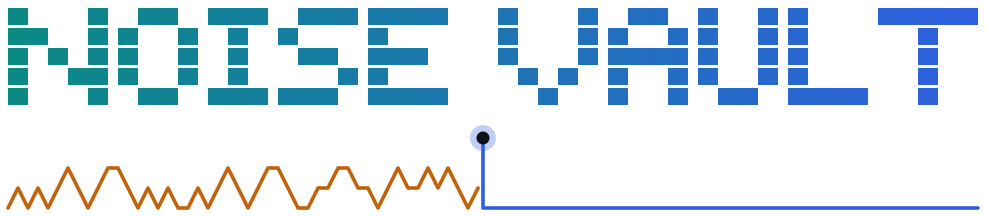
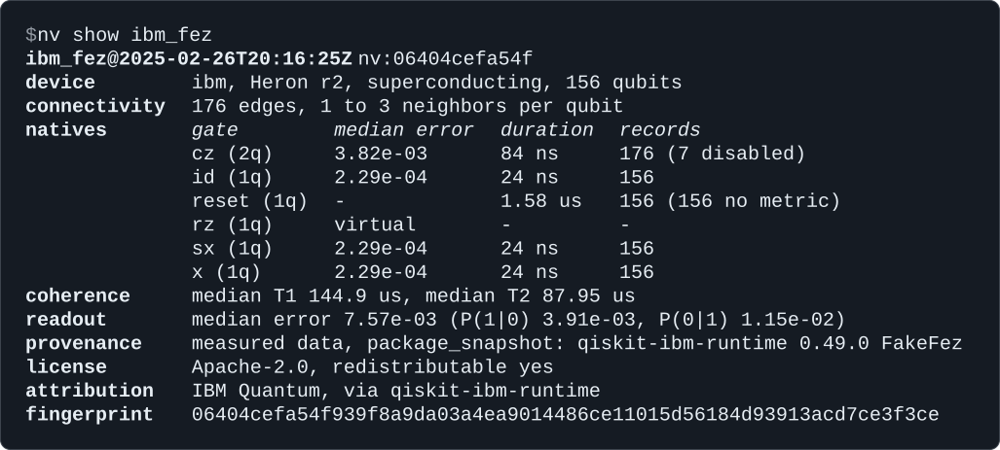

<p align="center">
  <picture>
    <source media="(prefers-color-scheme: dark)" srcset="assets/hero-dark.svg">
    
  </picture>
</p>

<div align="center">

**Calibrated noise from real quantum computers, as one file that works in Qiskit, Cirq, PennyLane and Stim.**

[](https://github.com/Kyoshiki-Murasaki/noisevault/actions/workflows/ci.yml)
[](LICENSE)
[](pyproject.toml)

[Install](#install) · [Quickstart](#quickstart) · [25 devices](#what-ships) · [Docs](#documentation) · [Changelog](CHANGELOG.md)

</div>

<br/>

Load a device by name and simulate your circuits under the noise it had on a given day. Pin the
profile's fingerprint, and anyone can rerun your results with the same noise. Each export reports
what it reproduces exactly, what it approximates and what it leaves out.

Try it without installing, using [uv](https://docs.astral.sh/uv/):

```bash
uvx --from git+https://github.com/Kyoshiki-Murasaki/noisevault nv show ibm_fez
```



## Install

In a virtual environment with Python 3.11 to 3.14, install NoiseVault from GitHub:

```bash
pip install "noisevault[qiskit] @ git+https://github.com/Kyoshiki-Murasaki/noisevault"
```

Use `cirq`, `pennylane` or `stim` in place of `qiskit`, name several as in
`noisevault[qiskit,stim]`, or use `all`. In a uv project, `uv add` takes the same quoted argument.
`nv doctor` lists what is installed.

## Quickstart

Run a GHZ circuit under the calibrated noise of IBM Fez. The profile ships with the package, so
this works offline.

```python
from qiskit import QuantumCircuit, transpile

import noisevault as nv

sim = nv.load("ibm_fez").to_qiskit()

ghz = QuantumCircuit(3)
ghz.h(0)
ghz.cx(0, 1)
ghz.cx(1, 2)
ghz.measure_all()

counts = sim.run(transpile(ghz, sim, seed_transpiler=1), seed_simulator=1).result().get_counts()
print(counts)
# {'111': 510, '011': 8, '101': 6, '100': 4, '001': 1, '110': 6, '010': 2, '000': 487}
print(sim.report.summary())
# NoiseVault 0.2.0 -> qiskit 2.5.2 (qiskit-aer 0.17.2): ibm_fez (nv:06404cefa54f)
# options: unknown_gates='typical', readout=True
# exact: gate noise: channels per exported native and physical locus (Aer QuantumError), ...
# approximated: cz error: the stated error already includes single-qubit gate error ...
# approximated: T2 of qubit 87: clamped to 2*T1 (the stated T2 exceeds 2*T1)
# omitted: idle time outside explicit delays (insert delays with transpile(circuit, sim, scheduling_method='alap'))
# unknown (no noise applied): preparation (reset) error of qubits [0, 1, 2, 3, 4, 5, 6, 7, ...] (156 qubits)
# clamped: 82 gates noisier than stated because relaxation alone exceeds the stated error; largest cz[91, 98] 0.00308 -> 0.0039
# used: cz took the calibration recorded for the opposite qubit order once
# Calibration-derived models approximate the hardware; they are not a digital twin.
```

`transpile` compiles to Fez's native gates and places the circuit by noise, because the
simulator carries the device's gates, connectivity and errors.

`to_cirq()`, `to_pennylane()` and `to_stim(circuit)` give the same noise to the other three
frameworks, each as the framework's own type with its own report.
[Frameworks](docs/frameworks.md) has an example for each.

## Pin a calibration

A bundled profile is one calibration. `nv pull` fetches others from IBM's public endpoint or
from IonQ, with no account, and saves them to your vault in `~/.noisevault/profiles`:

```bash
nv pull ibm_fez --at 2025-06-01   # saves ibm_fez@2025-05-31T22:01:04Z, the newest before then
nv cite ibm_fez@2025-05-31        # cite it by the date the pull printed
nv diff ibm_fez@2025-02-26 ibm_fez@2025-05-31
```

`nv diff` compares the device medians, lists the qubits and pairs that changed most, and names
the gates that were disabled or re-enabled.

A bare id such as `ibm_fez` loads the newest calibration you have, so after a pull it no longer
loads the bundled one. Add the date, as in `ibm_fez@2025-02-26`, to load a particular calibration.

The fingerprint is a SHA-256 hash of a profile's physics. Pass it when you load a profile, and
the load fails if the numbers ever differ:

```python
import noisevault as nv

fez = nv.load("ibm_fez@2025-02-26", expect="nv:06404cefa54f")
print(fez)
# <Profile ibm_fez@2025-02-26 superconducting 156q nv:06404cefa54f>
```

A mismatch raises `FingerprintMismatch` with both fingerprints. The
[pin and cite recipe](docs/recipes.md#pin-and-cite-a-calibration-for-a-paper) shows the full
workflow for a paper.

## What ships

These profiles ship inside the package and load offline with `nv.load(id)`. All come from
openly licensed sources, and [NOTICE](NOTICE) lists each file with its source. `nv list` shows
them with their qubit counts and processors.

| Vendor | Technology | Devices | Calibrated | Source and license |
| --- | --- | --- | --- | --- |
| IBM (18) | superconducting | `ibm_aachen`, `ibm_berlin`, `ibm_boston`, `ibm_brisbane`, `ibm_brussels`, `ibm_cusco`, `ibm_fez`, `ibm_kawasaki`, `ibm_kingston`, `ibm_kyiv`, `ibm_manila`, `ibm_marrakesh`, `ibm_miami`, `ibm_pittsburgh`, `ibm_quebec`, `ibm_sherbrooke`, `ibm_strasbourg`, `ibm_torino` | 2024-05-27 to 2026-04-17 | [qiskit-ibm-runtime](https://github.com/Qiskit/qiskit-ibm-runtime) fake backends, Apache-2.0 |
| Quantinuum (5) | trapped ion | `quantinuum_h1-1`, `quantinuum_h1-2`, `quantinuum_h2-1`, `quantinuum_h2-2`, `quantinuum_reimei` | 2023-08-21 to 2025-08-28 | [hardware-specifications](https://github.com/Quantinuum/quantinuum-hardware-specifications) repository, Apache-2.0 |
| Google (2) | superconducting | `google_rainbow`, `google_weber` | 2021-11-03 to 2021-11-16 | [cirq-google](https://github.com/quantumlib/Cirq/tree/main/cirq-google) calibrations, Apache-2.0 |

For more devices and dates, pull from an IBM Quantum account with `nv pull --source ibm-account`,
or import a Qiskit backend, an IBM calibration CSV, saved Amazon Braket device properties, a
cirq-google calibration or a dataset from Quantinuum's repository. The account pull and IBM's
fake backends need the `ibm` extra, and a cirq-google calibration needs the `google` extra.
[Data sources](docs/data-sources.md) gives each source's fields and license. To describe a device
that does not exist, use `nv.Profile.uniform(...)`, as in
[Describe a hypothetical device](docs/recipes.md#describe-a-hypothetical-device).

## Check a conversion

`nv check` runs small circuits through each installed export and compares the results with
NoiseVault's own density-matrix reference:

```text
$ nv check ibm_fez
ibm_fez@2025-02-26T20:16:25Z nv:06404cefa54f on qubits 136-143-142-141
4 circuits: ghz_chain, mirror, single_qubit, readout
framework  result      TVD  tolerance  circuits  method
qiskit     pass    1.1e-02    7.0e-02  4 of 4    exact + 20000 shots
cirq       pass    3.7e-16    1.0e-09  4 of 4    exact
pennylane  pass    6.1e-16    1.0e-09  4 of 4    exact
stim       pass    1.3e-03    5.6e-03  4 of 4    20000 shots, 5 sigma
```

A pass means each export implements the same noise model as the NoiseVault reference on these
circuits. It is not a measure of how well the model matches the hardware. Calibration-derived
models approximate the hardware. They are not a digital twin. [Limitations](docs/limitations.md)
lists what no export models.

To run the check with uv and no install:

```bash
uvx --from "noisevault[qiskit] @ git+https://github.com/Kyoshiki-Murasaki/noisevault" nv check ibm_fez
```

## Documentation

| Page | What it covers |
| --- | --- |
| [Frameworks](docs/frameworks.md) | Each export, its options and what its report can list |
| [Recipes](docs/recipes.md) | Pin and cite, drift, Mitiq, QEC with Stim, hypothetical devices, PennyLane training |
| [Data sources](docs/data-sources.md) | Bundled, pulled and imported data, with licenses |
| [Profile format](docs/profile-format.md) | Every field of format 1.0, with examples |
| [Conventions](docs/conventions.md) | Error metrics, channel construction, readout and qubit order |
| [Limitations](docs/limitations.md) | What the models leave out and what has been checked |
| [JSON Schema](docs/schema/profile-1.0.json) | The schema of format 1.0, also printed by `nv schema` |
| [Examples](examples) | Runnable scripts, from the quickstart to a QEC memory experiment |

## Contributing

Bug reports, new data sources and fixes are welcome. [CONTRIBUTING.md](CONTRIBUTING.md) covers
the development setup, the tests and how to add a source.

## Citing

If you use NoiseVault, cite the software with [CITATION.cff](CITATION.cff), or with
**Cite this repository** on GitHub. Also give the fingerprint of every profile you used.
`nv cite REF` prints it with the source, the calibration time, the NoiseVault version and the
ref that loads the calibration. `nv cite REF --bibtex` prints a BibTeX entry.

## License

Apache License 2.0. See [LICENSE](LICENSE). Bundled calibration data keeps the license and
attribution of its source. [NOTICE](NOTICE) lists every bundled file and where it comes from.

## Acknowledgements

The bundled calibrations come from IBM Quantum through
[qiskit-ibm-runtime](https://github.com/Qiskit/qiskit-ibm-runtime), from Google Quantum AI
through [cirq-google](https://github.com/quantumlib/Cirq), and from Quantinuum's
[hardware-specifications](https://github.com/Quantinuum/quantinuum-hardware-specifications)
repository. NoiseVault builds on [Qiskit](https://github.com/Qiskit/qiskit) and
[Qiskit Aer](https://github.com/Qiskit/qiskit-aer), [Cirq](https://github.com/quantumlib/Cirq),
[PennyLane](https://github.com/PennyLaneAI/pennylane), [Stim](https://github.com/quantumlib/Stim)
and [PyMatching](https://github.com/oscarhiggott/PyMatching).
