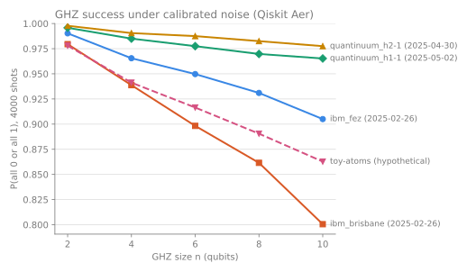

<p align="center">
  <picture>
    <source media="(prefers-color-scheme: dark)" srcset="assets/hero-dark.svg">
    
  </picture>
</p>

<div align="center">

**Calibrated noise from real quantum computers, as one file that works in Qiskit, Cirq, PennyLane and Stim.**

Load a device by name and simulate your circuits under the noise it had on a given day. Pin the profile's fingerprint, and anyone can rerun your results with the same noise. Each export reports what it reproduces exactly, what it approximates and what it leaves out.

<br/>

[](https://github.com/Kyoshiki-Murasaki/noisevault/actions/workflows/ci.yml)
[](LICENSE)
[](pyproject.toml)

[Quickstart](#quickstart) · [Docs](#documentation) · [Profiles](#what-ships) · [Recipes](docs/recipes.md) · [Changelog](CHANGELOG.md) · [Contributing](CONTRIBUTING.md)

<br/>


</div>

<br/>

## Install

NoiseVault is not on PyPI yet. Install it from GitHub with the extra for your framework:

```bash
pip install "noisevault[qiskit] @ git+https://github.com/Kyoshiki-Murasaki/noisevault@main"
```

With uv, add it to a project, or try the command line without installing:

```bash
uv add "noisevault[qiskit] @ git+https://github.com/Kyoshiki-Murasaki/noisevault@main"
uvx --from "git+https://github.com/Kyoshiki-Murasaki/noisevault@main" nv list
```

The core package needs only numpy, pydantic, typer and rich, and runs on Python 3.11 to 3.14.
Importing `noisevault` loads no framework. Each framework is an extra:

| Extra | Adds | For |
| --- | --- | --- |
| `qiskit` | qiskit, qiskit-aer | `to_qiskit()` |
| `ibm` | `qiskit` and qiskit-ibm-runtime | `nv pull --source ibm-account`, IBM fake backends |
| `cirq` | cirq-core | `to_cirq()` |
| `pennylane` | pennylane | `to_pennylane()` |
| `stim` | stim | `to_stim()` |
| `google` | `cirq` and cirq-google | `nv.from_cirq_google` |
| `all` | every extra above | Everything |

The command line is `nv`, with `noisevault` as a longer alias.

## Quickstart

Run a GHZ circuit under the calibrated noise of IBM Fez. The profile ships with the package, so
this works offline.

```python
from qiskit import QuantumCircuit, transpile

import noisevault as nv

sim = nv.load("ibm_fez").to_qiskit()

ghz = QuantumCircuit(3)
ghz.h(0)
ghz.cx(0, 1)
ghz.cx(1, 2)
ghz.measure_all()

counts = sim.run(transpile(ghz, sim, seed_transpiler=1), seed_simulator=1).result().get_counts()
print(counts)
# {'111': 510, '011': 8, '101': 6, '100': 4, '001': 1, '110': 6, '010': 2, '000': 487}
print(sim.report.summary())
# ...
# exact: gate noise: channels per exported native and physical locus (Aer QuantumError), ...
# approximated: T2 of qubit 87: clamped to 2*T1 (the stated T2 exceeds 2*T1)
# omitted: idle time outside explicit delays (insert delays with transpile(circuit, sim, ...
# clamped: 82 gate(s) noisier than stated because relaxation alone exceeds the stated error; largest cz[91, 98] 0.00308 -> 0.0039
# ...
# Calibration-derived models approximate the hardware; they are not a digital twin.
```

`transpile` compiles to Fez's native gates and places the circuit by noise, because the
simulator carries the device's gates, connectivity and errors.

The same profile gives a noise model for the other three frameworks, as the framework's own type.
Each report lists what that framework leaves out. This block needs the `cirq`, `pennylane` and
`stim` extras, or `all`:

```python
import stim

import noisevault as nv

fez = nv.load("ibm_fez")
cirq_model = fez.to_cirq()  # for cirq.DensityMatrixSimulator(noise=cirq_model)
pl_model = fez.to_pennylane()  # for qml.add_noise(qnode, pl_model)
noisy = fez.to_stim(stim.Circuit("CZ 0 1\nM 0 1"))  # a stim.Circuit with the noise written in
print(cirq_model.report.omitted)
print(pl_model.report.omitted)
print(noisy)
# ['preparation error of the initial state (only resets get it)', 'idle noise outside WaitGate ...
# ['idle time between gates (PennyLane circuits are not scheduled)', 'readout on mid-circuit ...
# CZ 0 1
# PAULI_CHANNEL_2(0.000819345, 0.000819345, 0.000794148, 0.00116305, ...) 0 1
# M(0.0114746) 0
# M(0.0117188) 1
```

[Frameworks](docs/frameworks.md) has a full example for each, and what each report can list.

## Pin a calibration

A bundled profile is one calibration. `nv pull` fetches others from IBM's public endpoint or
from IonQ, with no account, and saves them to your vault in `~/.noisevault/profiles`:

<!-- not-run: nv pull and nv diff fetch calibrations from IBM over the network -->
```bash
nv pull ibm_fez --at 2025-06-01   # the newest calibration before that time
nv cite ibm_fez@2025-05-31        # a citation with the full fingerprint
nv diff ibm_fez@2025-02-26 ibm_fez@2025-05-31
```

```text
ibm_fez@2025-02-26 -> ibm_fez@2025-05-31  (94 days 1 hour later)
device median    before     after  change
T1 (us)           144.9       145   +0.1%
T2 (us)           87.95     100.6  +14.4%
1q error       2.29e-04  2.81e-04  +22.8%
2q error       3.82e-03  3.10e-03  -18.7%
readout error  7.57e-03  7.81e-03   +3.2%
...
```

`nv diff` goes on to list the qubits and pairs that changed most, and the gates that were
disabled or re-enabled.

The fingerprint is a SHA-256 hash of a profile's physics. Pass it when you load a profile, and
the load fails if the numbers ever differ:

```python
import noisevault as nv

fez = nv.load("ibm_fez@2025-02-26", expect="nv:06404cefa54f")
print(fez)
# <Profile ibm_fez@2025-02-26 superconducting 156q nv:06404cefa54f>
```

A mismatch raises `FingerprintMismatch` with both fingerprints. The
[pin and cite recipe](docs/recipes.md#pin-and-cite-a-calibration-for-a-paper) shows the full
workflow for a paper.

## What ships

These profiles ship inside the package and load offline with `nv.load(id)`. All come from
openly licensed sources, and [NOTICE](NOTICE) lists each file with its source. `nv list` shows
them with their qubit counts and processors.

| Vendor | Technology | Devices | Calibrated | Source and license |
| --- | --- | --- | --- | --- |
| IBM (18) | superconducting | `ibm_aachen`, `ibm_berlin`, `ibm_boston`, `ibm_brisbane`, `ibm_brussels`, `ibm_cusco`, `ibm_fez`, `ibm_kawasaki`, `ibm_kingston`, `ibm_kyiv`, `ibm_manila`, `ibm_marrakesh`, `ibm_miami`, `ibm_pittsburgh`, `ibm_quebec`, `ibm_sherbrooke`, `ibm_strasbourg`, `ibm_torino` | 2024-05-27 to 2026-04-17 | [qiskit-ibm-runtime](https://github.com/Qiskit/qiskit-ibm-runtime) fake backends, Apache-2.0 |
| Quantinuum (5) | trapped ion | `quantinuum_h1-1`, `quantinuum_h1-2`, `quantinuum_h2-1`, `quantinuum_h2-2`, `quantinuum_reimei` | 2023-08-21 to 2025-08-28 | [hardware-specifications](https://github.com/Quantinuum/quantinuum-hardware-specifications) repository, Apache-2.0 |
| Google (2) | superconducting | `google_rainbow`, `google_weber` | 2021-11-03 to 2021-11-16 | [cirq-google](https://github.com/quantumlib/Cirq/tree/main/cirq-google) calibrations, Apache-2.0 |

Other sources give you more devices and dates. A pull saves to your vault. An import returns a
profile that you save with `profile.save(path)`.

| Source | How | Account | History |
| --- | --- | --- | --- |
| IBM public endpoint | `nv pull ibm_fez` | No | Yes, `--at` |
| IBM Quantum account | `nv pull ibm_fez --source ibm-account` | Yes | Yes, `--at` |
| IonQ characterizations | `nv pull ionq_forte-1` | No | Yes, `--at` |
| Qiskit backend | `nv.from_qiskit_backend(backend)` | For account backends | No |
| IBM calibration CSV | `nv.from_ibm_csv(path, device=..., calibrated_at=...)` | To download it | One file per calibration |
| Amazon Braket device properties | `nv.from_braket(path)` | To save them | One file per snapshot |
| cirq-google calibrations | `nv.from_cirq_google("willow_pink")` | No | No |
| Quantinuum repository | `noisevault.sources.quantinuum.from_repository("H1-1", date)` | No | One dataset per date |

To describe a device that does not exist, use `nv.Profile.uniform(...)` or write a profile by
hand. [Data sources](docs/data-sources.md) gives each source's fields and license.

## Compare devices



GHZ success probability against circuit size for four bundled devices and one hypothetical
neutral-atom profile, simulated in Qiskit by [`examples/compare_devices.py`](examples/compare_devices.py). The
simulation includes gate and readout noise but not idle time between gates.

## How it works

```text
profile (JSON)  ->  resolver: one error, duration and readout for each gate and qubit
                      -> to_qiskit()     AerSimulator with the device's Target
                      -> to_cirq()       cirq.NoiseModel
                      -> to_pennylane()  qml.NoiseModel
                      -> to_stim(c)      stim.Circuit with Pauli channels
                    each export carries a .report: exact, approximated, omitted, unknown
```

A profile states each number with its metric and units, such as `avg_infidelity` from
randomized benchmarking. The resolver applies per-qubit and per-gate records over device-wide
defaults. Each export builds its channels from the result, and its report lists every
difference from the full model. [Conventions](docs/conventions.md) defines the channels.

Calibration-derived models approximate the hardware. They are not a digital twin.
[Limitations](docs/limitations.md) lists what no export models.

`nv check` checks a conversion. It runs small circuits through each installed export and
compares the results with NoiseVault's own density-matrix reference:

```text
$ nv check ibm_fez
ibm_fez nv:06404cefa54f on qubits 136-143-142-141
3 circuits: ghz_chain, mirror, single_qubit
framework  result  max TVD  tolerance  circuits  method
qiskit     pass    1.1e-02    7.0e-02  3 of 3    exact + 20000 shots
cirq       pass    3.7e-16    1.0e-09  3 of 3    exact
pennylane  pass    5.7e-16    1.0e-09  3 of 3    exact
stim       pass    6.9e-03    1.1e-02  3 of 3    20000 shots, 5 sigma
```

A pass means the export matches the reference on these circuits. It says nothing about how
well the model matches the hardware.

## Use cases

- **Reproducible noisy simulation.** Pin a profile by fingerprint in a paper or a test suite.
  The same file gives every framework the same calibration, and each report lists what that
  framework leaves out.
- **Error mitigation studies.** Test zero-noise extrapolation against the noise of a real
  device. See the [Mitiq recipe](docs/recipes.md#mitigate-errors-with-mitiq).
- **QEC at scale with Stim.** Put a device's noise on a surface-code memory experiment and
  decode it with PyMatching. See the
  [QEC recipe](docs/recipes.md#run-a-qec-memory-experiment-with-stim-and-pymatching).
- **Comparing devices and dates.** Run one circuit on several devices, or diff two calibrations
  of one device. See [drift between two dates](docs/recipes.md#compare-drift-between-two-dates).

## Documentation

| Page | What it covers |
| --- | --- |
| [Frameworks](docs/frameworks.md) | Each export, its options and what its report can list |
| [Recipes](docs/recipes.md) | Pin and cite, drift, Mitiq, QEC with Stim, hypothetical devices, PennyLane training |
| [Data sources](docs/data-sources.md) | Bundled, pulled and imported data, with licenses |
| [Profile format](docs/profile-format.md) | Every field of format 1.0, with examples |
| [Conventions](docs/conventions.md) | Error metrics, channel construction, readout and qubit order |
| [Limitations](docs/limitations.md) | What the models leave out and what has been checked |
| [JSON Schema](docs/schema/profile-1.0.json) | The schema of format 1.0, also printed by `nv schema` |
| [Examples](examples) | Runnable scripts, from the quickstart to a QEC memory experiment |

## Contributing

Bug reports, new data sources and fixes are welcome. [CONTRIBUTING.md](CONTRIBUTING.md) covers
the development setup, the test commands and how to add a source. The tests run every Python
block in this README and in `docs/`.

## Citing

If you use NoiseVault, cite the software with [CITATION.cff](CITATION.cff), or with
**Cite this repository** on GitHub. Also give the fingerprint of every profile you used.
`nv cite REF` prints it with the source and calibration time, and `nv cite REF --bibtex` prints
a BibTeX entry.

## License

Apache License 2.0. See [LICENSE](LICENSE). Bundled calibration data keeps the license and
attribution of its source. [NOTICE](NOTICE) lists every bundled file and where it comes from.

## Acknowledgements

The bundled calibrations come from IBM Quantum through
[qiskit-ibm-runtime](https://github.com/Qiskit/qiskit-ibm-runtime), from Google Quantum AI
through [cirq-google](https://github.com/quantumlib/Cirq), and from Quantinuum's
[hardware-specifications](https://github.com/Quantinuum/quantinuum-hardware-specifications)
repository. NoiseVault builds on [Qiskit](https://github.com/Qiskit/qiskit) and
[Qiskit Aer](https://github.com/Qiskit/qiskit-aer), [Cirq](https://github.com/quantumlib/Cirq),
[PennyLane](https://github.com/PennyLaneAI/pennylane), [Stim](https://github.com/quantumlib/Stim)
and [PyMatching](https://github.com/oscarhiggott/PyMatching).
