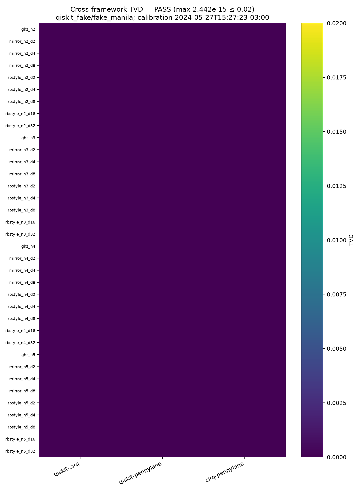
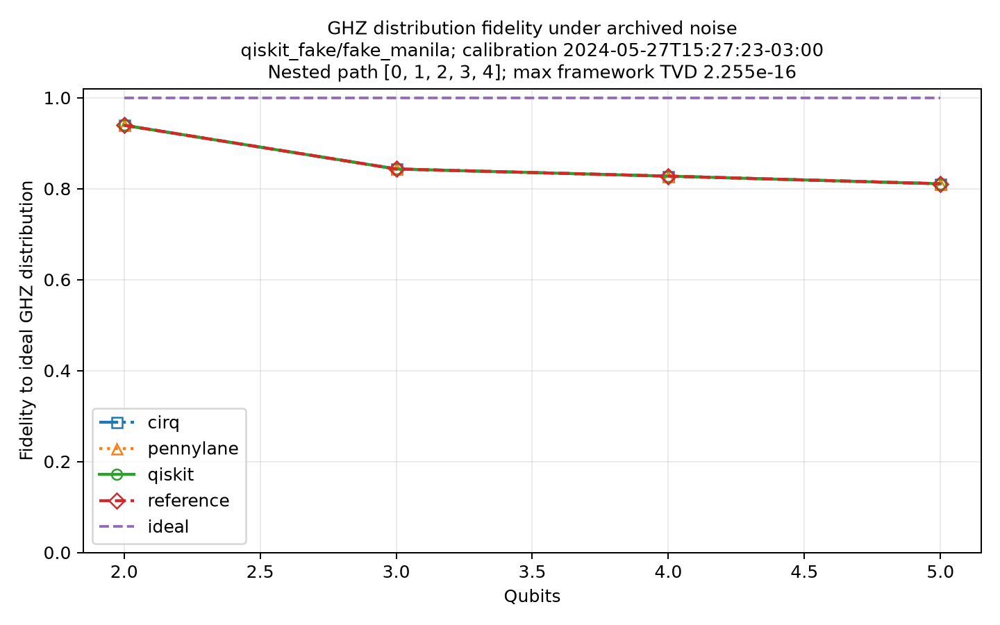
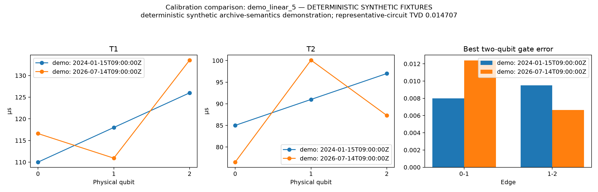

# NoiseVault Pilot Results

**Overall status:** `OFFLINE_PILOT_VERIFIED_WITH_CALIBRATION_ARTIFACTS`

Run timestamp: `2026-07-14T09:28:19.523710Z`  
Execution mode: `auto` / `full`  
Primary snapshot: `snapshots/qiskit_fake/fake_manila/2024-05-27T15-27-23-03-00.json`  
Data classification: **Packaged Qiskit fake-backend calibrations plus deterministic fixtures; no live hardware claim.**
Live IBM authentication: **unavailable**  
Hardware job ran: **no**

## Scope and integrity statement

No result is labeled as live hardware evidence unless its snapshot provenance identifies the IBM Quantum Platform. Committed demo snapshots are synthetic fixtures and are retained only so CI and autonomous agents can verify the entire pipeline without credentials.

## Headline numbers

- Snapshots discovered: **3** across **2** backend names.
- Frameworks completed: **qiskit, cirq, pennylane**.
- Benchmark circuits with all requested framework results: **36**.
- Maximum pairwise cross-framework TVD: **2.442491e-15** (threshold ≤ 0.02000; **PASS**).
- Native Aer reconstruction maximum TVD: **2.984230e-10** (target < 0.01000; **PASS**).
- Drift demonstration simulation TVD: **0.01471**.

## Snapshot inventory

| Provider | Backend | Calibration/source timestamp | Qubits | Raw hash | Path |
|---|---|---:|---:|---|---|
| `demo` | `demo_linear_5` | `2024-01-15T09:00:00Z` | 5 | `sha256:98d477858773707ad4dd3b1f9014dd14f9f0ed0304f4f3b16f615e8d5c9335e3` | `snapshots/demo/demo_linear_5_2024-01-15.json` |
| `demo` | `demo_linear_5` | `2026-07-14T09:00:00Z` | 5 | `sha256:5cc220806770ce1fb642583e02a624947a06860d3928d1075e4be2228c6a9ad9` | `snapshots/demo/demo_linear_5_2026-07-14.json` |
| `qiskit_fake` | `fake_manila` | `2024-05-27T15:27:23-03:00` | 5 | `sha256:f79216df928d9dba24b98d2f65f3bbf4b918c46e61e7a6455f0c8218ae4179a0` | `snapshots/qiskit_fake/fake_manila/2024-05-27T15-27-23-03-00.json` |

## Experiment A — Qiskit native-model reconstruction

Status: `complete` / **PASS**. Backend: `fake_manila`. Data provider: `qiskit_fake`. Maximum TVD: **2.984230e-10**, with a strict target below **0.01000**.
The reconstructed per-gate average infidelities match Aer's model target to maximum absolute delta **8.326673e-17**. When the archived gate error lies below the relaxation floor, both models retain the physical relaxation floor rather than forcing an impossible target.

- Comparison uses prefix qubits so native and reconstructed qargs align without private NoiseModel remapping.
- Every entangling operation uses an exact direction-aligned calibration.
- Residual depolarization is solved after relaxation so the composed channel targets the archived average gate error.
- Readout error is disabled in both models; Experiment B/D apply readout through the shared exact post-processor.

## Experiment B — Cross-framework agreement

Status: `complete` / **PASS**. Complete circuits: **36 / 36**. Pairwise TVD maximum: **2.442491e-15**; mean: **6.386882e-16**; threshold: **≤ 0.02000**.

The comparison executes the exported Qiskit Aer, Cirq, and PennyLane converter objects in their independent density-matrix engines. It uses one common asymmetric readout-confusion post-processor so the measured difference isolates quantum-channel conversion rather than framework-specific sampling or readout APIs.



## Experiment C — Noise realism sanity check

Status: `complete`. The plotted quantity is classical fidelity to the ideal GHZ distribution on nested physical path `[0, 1, 2, 3, 4]`. Maximum GHZ cross-framework TVD: **2.255141e-16**.

- 2 qubits: reference fidelity **0.93936**.
- 3 qubits: reference fidelity **0.84326**.
- 4 qubits: reference fidelity **0.82749**.
- 5 qubits: reference fidelity **0.81074**.



## Experiment D — Versioned drift demonstration

Status: `complete`. Older snapshot: `snapshots/demo/demo_linear_5_2024-01-15.json`. Newer snapshot: `snapshots/demo/demo_linear_5_2026-07-14.json`.

Pair classification: **deterministic synthetic archive-semantics demonstration**. Providers: `demo, demo`. Source timestamps: `2024-01-15T09:00:00Z` → `2026-07-14T09:00:00Z`. Empirical calibration evidence: **no**.

The representative circuit distribution changed by maximum TVD **0.01471** between the two distinct snapshot payloads. Older and newer probability vectors are saved for every framework so this value can be recomputed independently. Deterministic fixtures demonstrate archive semantics only and are not device-drift evidence.



## Validation and failures

- `live_harvest`: IBM Quantum authentication is unavailable. Set IBM_QUANTUM_TOKEN or save an IBM Quantum Platform account.

## Interpretation constraints

Calibration-derived Markovian channels do not capture crosstalk, leakage, non-Markovian effects, coherent calibration errors, or workload-dependent drift. Cross-framework agreement proves converter consistency, not hardware accuracy. No QPU job ran in this pilot. A live hardware point is optional and must never be inferred from packaged calibrations or deterministic fixtures.

## Reproduction

```bash
python -m venv .venv
source .venv/bin/activate
python -m pip install -e '.[pilot]'
python scripts/run_pilot.py --mode auto --profile full
```

Machine-readable results, including per-framework probability vectors, are in `results/pilot_results.json`.
